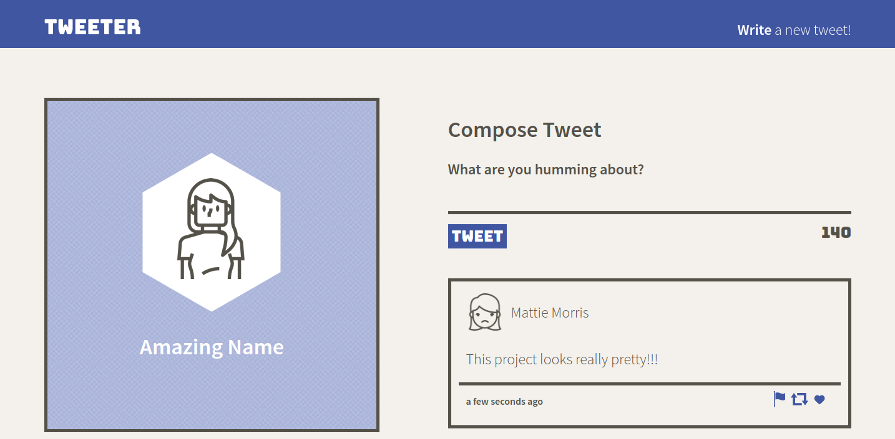
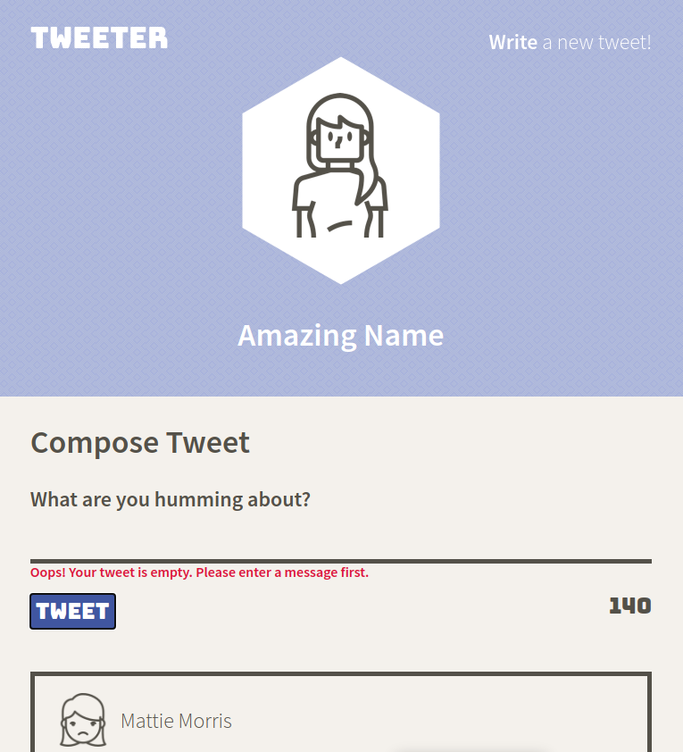
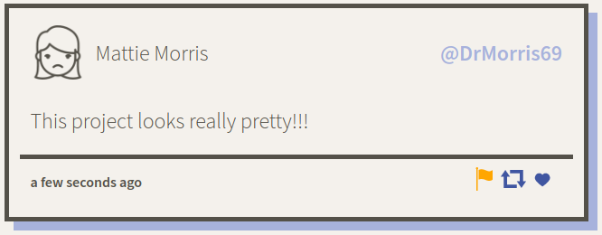
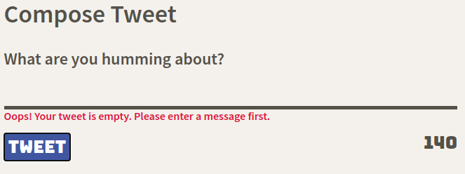
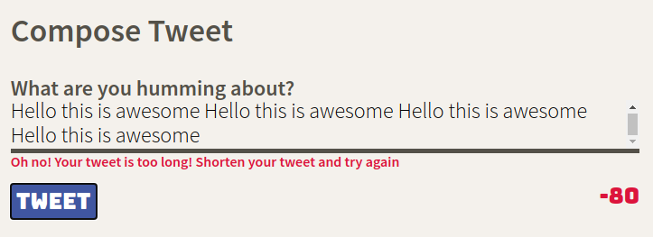

# Tweeter Project

Tweeter is a simple, single-page Twitter clone.

This project features client-side JS with JQuery and Ajax, interacting with a prebuilt Node + Express server to display tweets. It also features HTML and SCSS with responsive design for mobile and desktop screens, and light animations.

## Getting Started

1. Fork this repository, then clone your fork of this repository.
2. Install dependencies using the `npm install` command.
3. Start the web server using the `npm run local` command. The app will be served at <http://localhost:8080/>.
4. Go to <http://localhost:8080/> in your browser.

## Dependencies

- Express
- Node 5.10.x or above
- nodemon
- body-parser
- chance

## References

- JQuery SVG by Keith Wood: http://keith-wood.name/svg.html
- Icons from https://thenounproject.com:
  - Heart by BomSymbols from the Noun Project: https://thenounproject.com/icon/689240/
  - repost by Anhar Ismail from the Noun Project: https://thenounproject.com/icon/2908225/
  - Flag by Nubaia Karim Barsha from the Noun Project: https://thenounproject.com/icon/2207078/
  - up by Arthur Shlain from the Noun Project: https://thenounproject.com/icon/98968/
